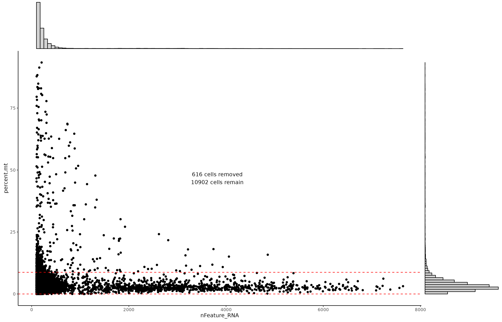
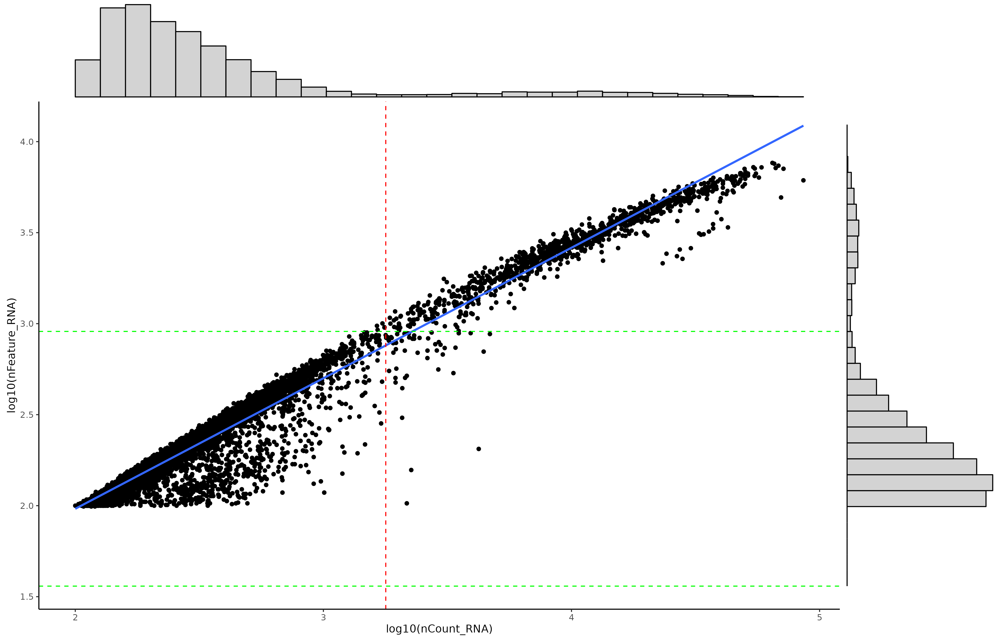
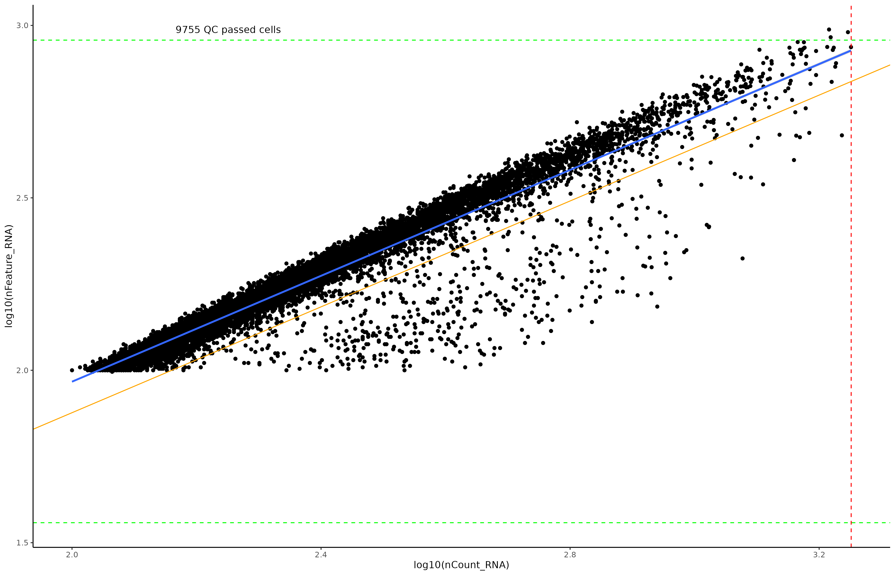
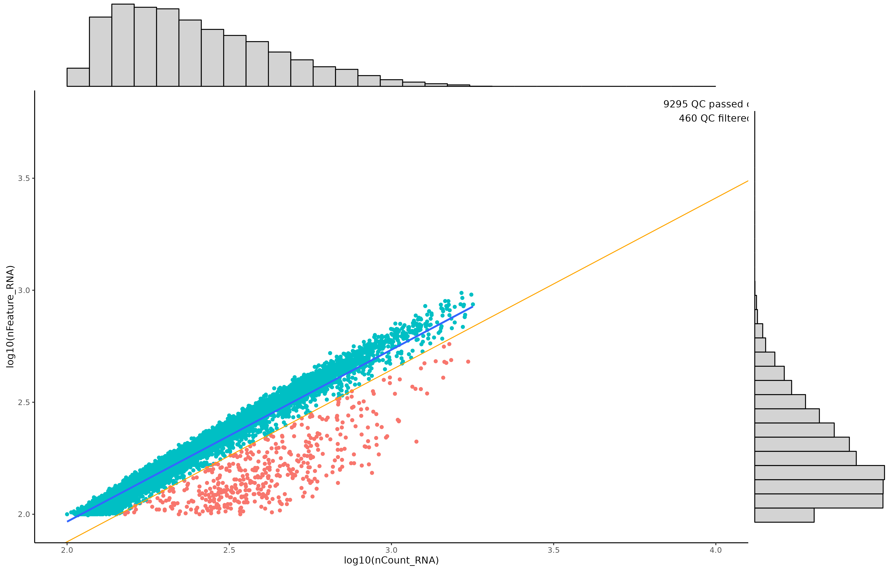
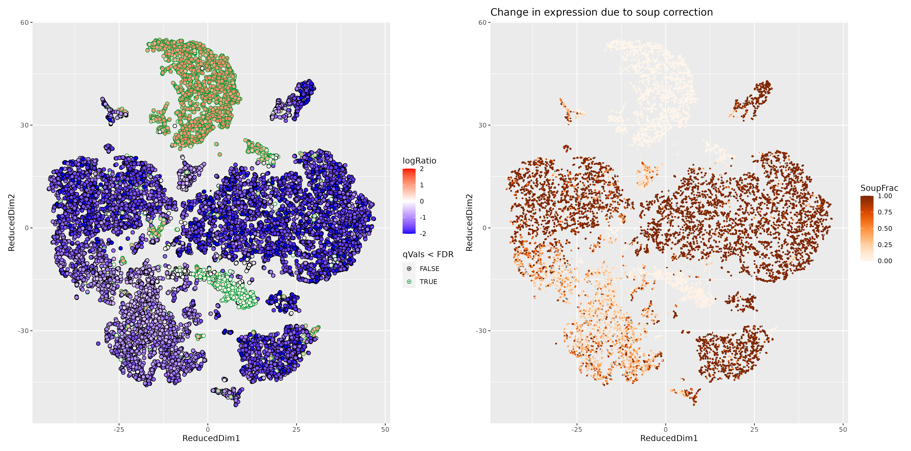

# Dynamic filtering

`calculate_filtering_param` is a function that returns the possible filter thresholds, 
using the MAD (Median absolute deviation) statistics. `calculate_filtering_param` requires
a raw/unfiltered Seurat object, and it returns a table containing the suggested filters.

<div class="alert alert-info">
  <strong>NOTE:</strong> By Default, it **does not apply** the filtering, but this behaviour can be changed by setting `apply = TRUE`
</div>

## Run the function

```{r echo =FALSE, eval = TRUE}
library(kableExtra)
```

```{r echo=TRUE, eval=FALSE}
library(Seurat)
library(scR)

raw_feature_matrix <- load_10x_gem(rawDIR = "./outs/raw_data/C1", source = "raw", source_type="h5", fixed = FALSE)
unfilt_st <- CreateSeuratObject(counts = raw_feature_matrix, project = "C1")
# Calculate % of MT genes
unfilt_st <- calculate_mito_ribo(unfilt_st, organism = "human")

calculate_filtering_param("C1", unfilt_st, outDIR = "./Samples_QC", apply = FALSE)

```

## Filters for the mitochondrial content



## Filters for the number of genes (nFeatures) and the UMIs (nCount) detected



## Detection of the main cell population





## Summarise the thresholds

Suggested filtering parameters are displayed as data.frame

```{r echo=FALSE, eval=TRUE}
result <- read.csv("./1_Pre-processing/5_calculated_thresholds.csv")
kable(result, booktabs = TRUE) %>%   kable_styling(latex_options = "striped")
```

# Ambient RNA (SoupX) 

Ambient RNA contamination can be detected and corrected using the function `estimate_ambient_rna`, 
which is a wrapper to **SoupX**.

```{r echo=TRUE, eval=FALSE}
estimate_ambient_rna("C1","/raw_data/C1", estGenes = NULL, counts2disk = FALSE)
```

The main output is a table with the quantification of the contamination

```{r echo=FALSE, eval=TRUE, fig.cap="Concatenated output of multiple samples"}
soup_result <- read.csv("./1_Pre-processing/7_ambient_rna_levels.csv")
kable(soup_result, booktabs = TRUE) %>%   kable_styling(latex_options = "striped")
```

In addition, the function returns the **MarkerMap** plots of the genes used to estimate the contamination.




