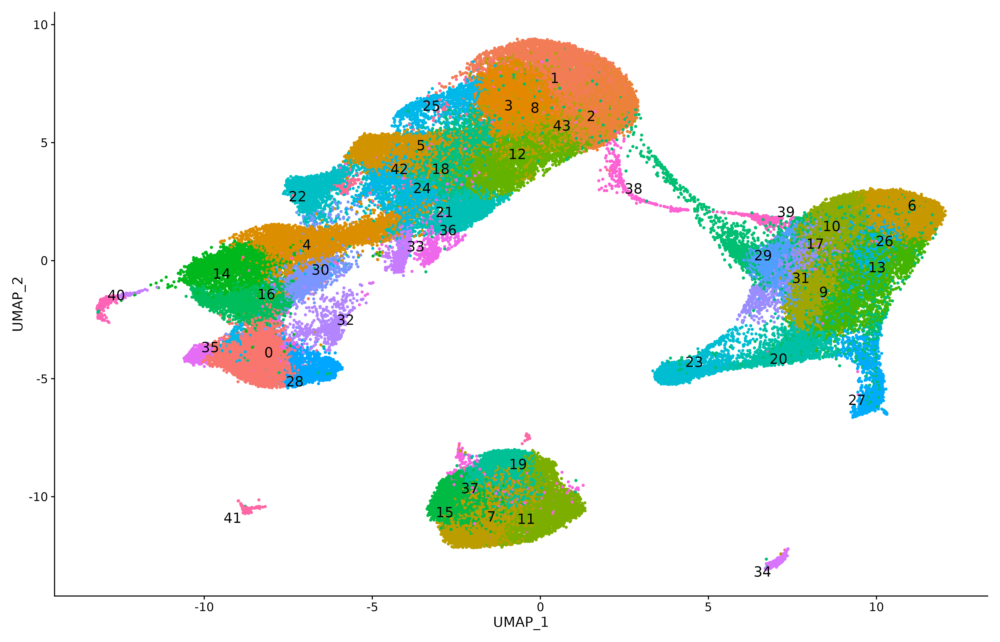

In `scR` the integration step is implemented into a two step process:

* Samples pre-processing (QC, filtering, normalisation, and clustering)

* Integration

```{r echo=TRUE, eval=FALSE}
library(Seurat)
library(future)
library(scR)
library(kableExtra)

plan("multisession", workers = 6)
setwd("03_processed_data")

print(exp_meta) 
```

```{r echo=FALSE, eval=TRUE}
library(kableExtra)
samples_list <- c("Sample1","Sample2")
exp_meta <- data.frame(SampleID = samples_list,
                       dataDIR = c("/mnt/disk1/sc-pipelines/scR/data","/mnt/disk1/projects/experiment-1"),
                       group = c("Control","Patient"))

kable(exp_meta, booktabs = TRUE) %>%   kable_styling(latex_options = "striped")

```

## Samples pre-processing

```{r echo=TRUE, eval=FALSE}
for(number in 1:nrow(exp_meta)){
   run_qc_and_filtering(exp_meta,number,"SCT" ,minFeatures = 500, mtPerc = 5, 
                       source = "raw", source_type = "h5", organism = "human", isVerbose=TRUE)
}

```

At the end of the run, for each samples multiple QC files are generate, together with a rds
file (e.g. `filtered_NK_CAEBV_3_logNorm.rds`) containing the filtered and pre-analised (PCA, clustering, UMAP) seurat object. 

Processing each sample individually is expensive both in time and resources, but it allows 
for a better quantification of the quality of the samples.

## Integration

`scR` supports different integration pipelines based on the version of seurat and the type 
of methodology the user wants to run. These pipelines are implemented into 4 functions:

* **run_seurat_integration_v5**: Integration with the new Seurat`v5` (With and without reference samples)

* **sketch_integration**: Sketch integration as implemented in Seurat`v5`

* **run_seurat_integration**: Integration without reference samples 

* **run_integration_with_Ref**: Integration with reference samples 


```{r echo=TRUE, eval=FALSE}

# directory containing the pre-processed rds file of all the samples (previous step)
dataDIR <- "."

run_seurat_integration_v5(dataDIR, intMethod = "rpca",  checkpoint = FALSE, 
                          outname = "int1_rpca_logNorm_v1", nfeatures = 3000, 
                          pcDims = 30, isVerbose = TRUE, isSCT = FALSE,
                          merge_layers = TRUE, seurat5 = TRUE, bpcells_dir=NULL)
```

### Reference based integration 

```{r echo=TRUE, eval=FALSE}

# the reference is a list of samples
reference <- c("C1","C2")
run_integration_with_Ref(dataDIR, "SCT", "cca", "int2_sct_cca_wRef", 
                                reference, ref_as_rds = FALSE, isVerbose = TRUE)

# the reference is an already processed dataset
reference <- readRDS("./dataset_to_use_as_reference.rds")
run_integration_with_Ref(dataDIR, "SCT", "cca", "int1_sct_cca_wRef", 
                                reference, ref_as_rds = TRUE, isVerbose = TRUE)

```

## Visualise the resulting uMAP

```{r echo=TRUE, eval=FALSE}
exp_Integrated <- readRDS("int1_rpca_logNorm_v1")
DimPlot(exp_Integrated)
```

