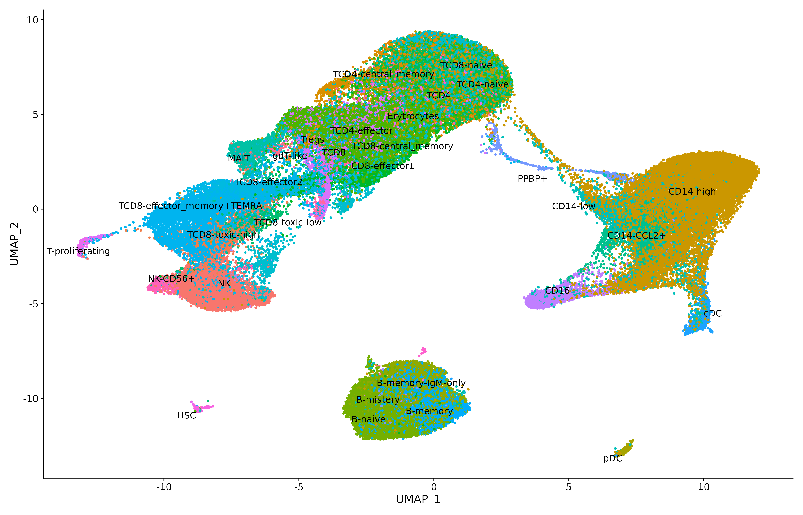
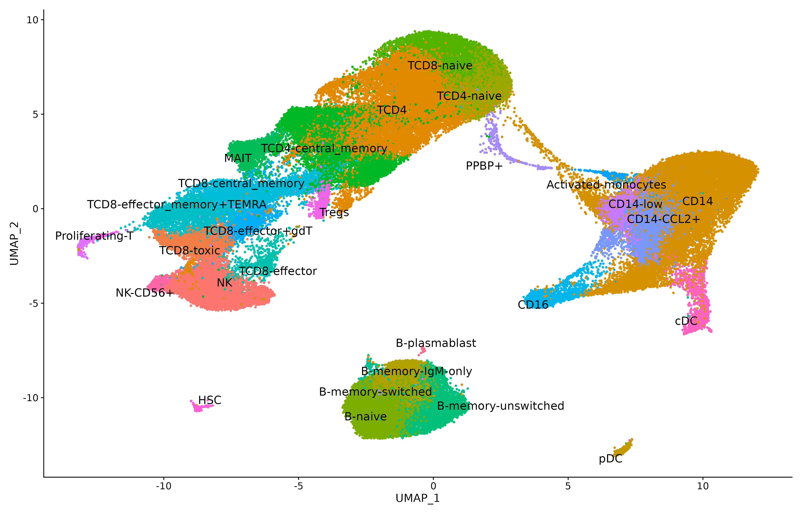
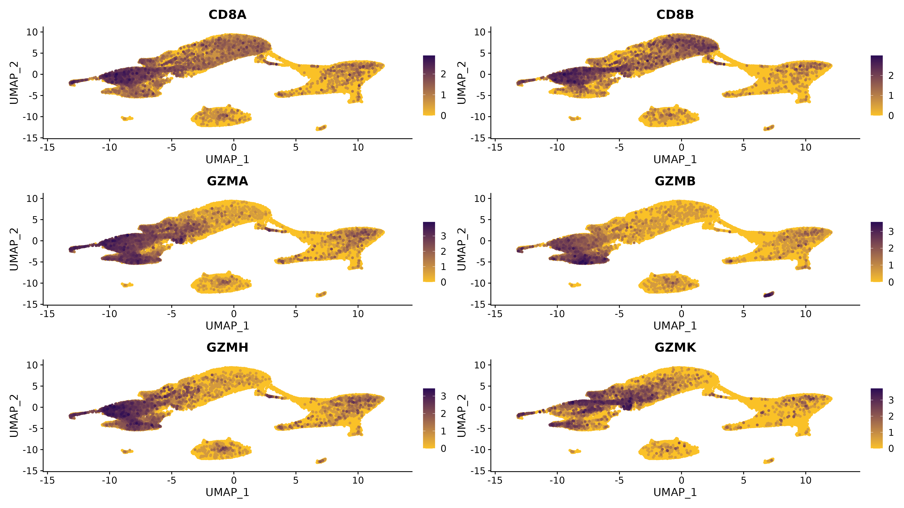
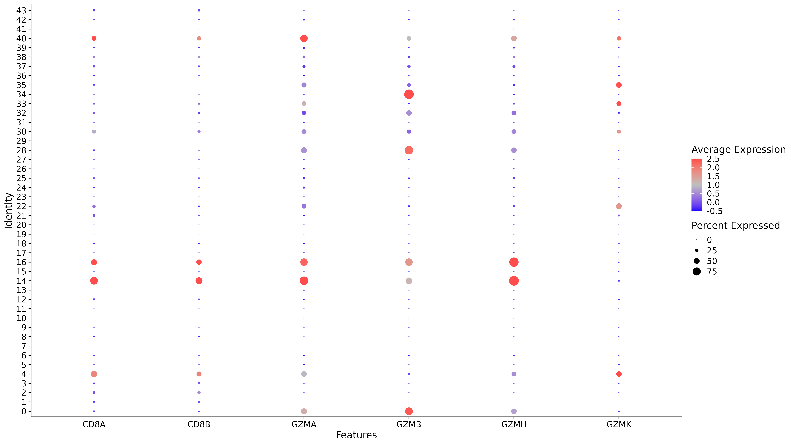
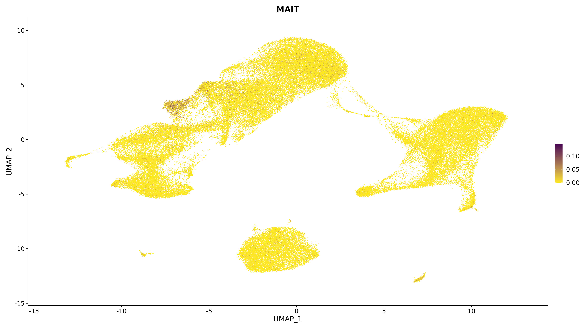
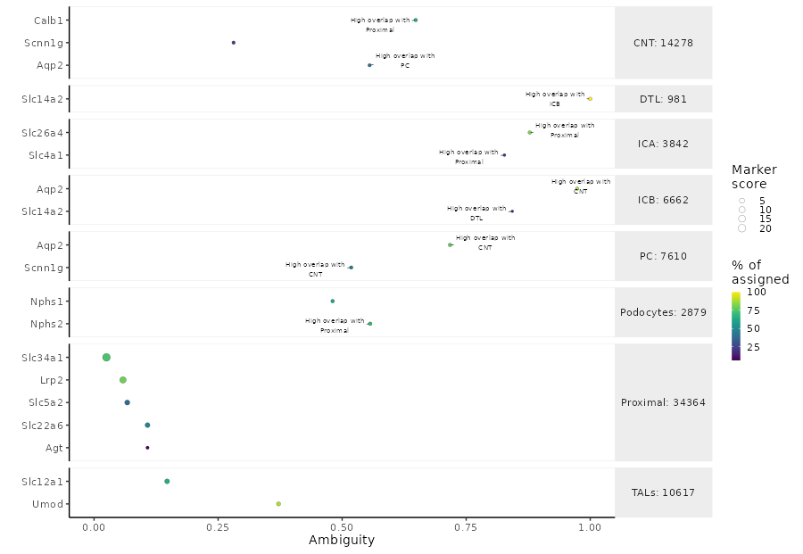

# Load the data

```{r echo=TRUE, eval=FALSE}
library(Seurat)
library(ggplot2)
library(scR)

# load the reference marker datasets
data(ABIS_markers)
data(pbmc_markers_annotated)
data(pbmc_markers)

exp_Integrated <- readRDS("./intX_sct_cca.rds")
DimPlot(exp_Integrated)
```


# Transfer labels

```{r echo=TRUE, eval=FALSE}
reference <- readRDS("/path/to/reference/reference.rds")

DefaultAssay(exp_Integrated) <- "integrated"
DefaultAssay(reference) <- "integrated"
exp_Integrated <- transfer_annotation(reference, exp_Integrated,
                                      "SCT", "cellType_final",
                                      projectUMAP = FALSE, isVerbose = TRUE)

# drop intermediate columns
drop <- grep("prediction.score",names(exp_Integrated@meta.data))
exp_Integrated@meta.data <- exp_Integrated@meta.data[,-drop]

```



An here is the manually curated annotation




# Cell Markers

For each cell type defined in the reference marker datasets `scR` can plot their expression or a representative signature. 

<div class="alert alert-info">
  <strong>NOTE:</strong> For cluster annotation the use of dotplot is strongly advised, as they are a good method of both qualify and quantify the expression in each cluster.
</div>


## Gene expression

```{r echo=TRUE, eval=FALSE}
figDIR <- "./markers_res2.2"
plot_cells_markers(exp_Integrated, figDIR, "integrated_snn_res.2.2", srt_assay = "SCT", overlapPlot=NULL)
```





## Signature

```{r echo=TRUE, eval=FALSE}
figDIR <- "./signatures"
plot_cell_signature(exp_Integrated, figDIR, "integrated_snn_res.2.2", srt_assay = "SCT")
```




## Markers ambiguity check

It is also possible to check the ambiguity and overlap of the markers using `monocle3`.

<div class="alert alert-info">
  <strong>NOTE:</strong> The conversion Seurat -> Monocle is done on the fly by **validate_markers**
</div>

```{r echo=TRUE, eval=FALSE}
marker_file_path <- "/path/to/markers_tissue.txt"
markers_check <- validate_markers(exp_Integrated,marker_file_path, "mice")

plot_mark <- plot_markers(markers_check)
```



