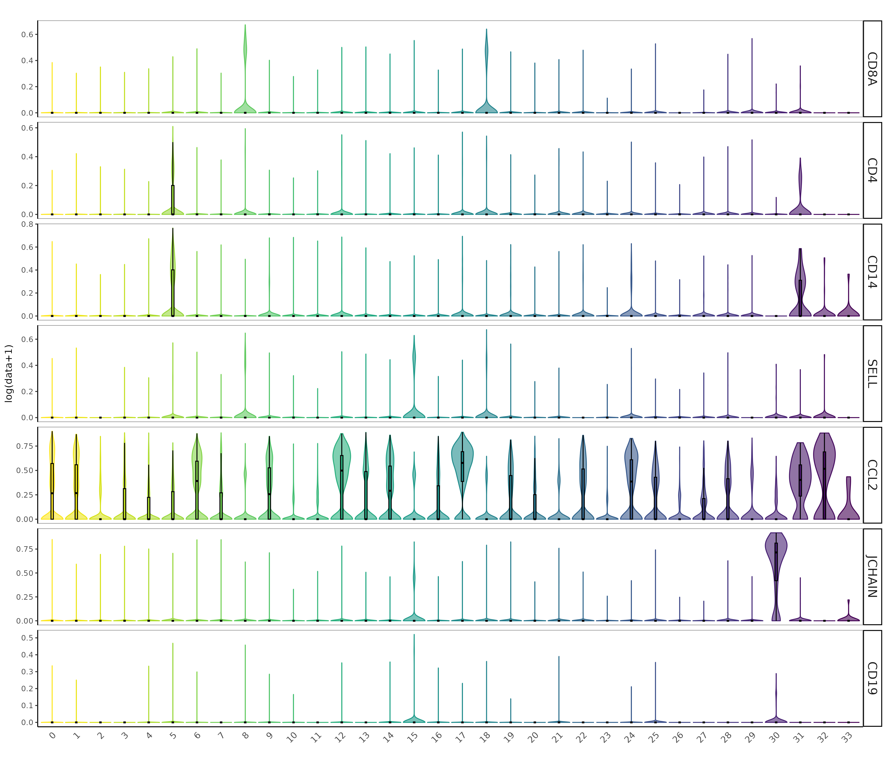
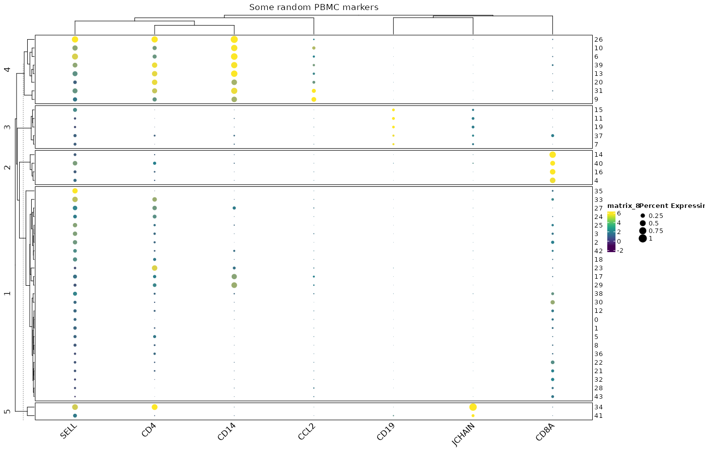

```{r echo=FALSE, eval=FALSE}
library(Seurat)
library(SeuratData)
library(ggplot2)
library(scR)

```

## Violin plot

```{r echo=TRUE, eval=FALSE}

pbmc_markers <- c("CD8A","CD4","CCL2",
                  "CD14","SELL","CD19","JCHAIN")

plot1 <- VlnPlot_modified(exp_Integrated, pbmc_markers, 
                          group_by = "integrated_snn_res.2.2", split_by = NULL, 
                          idents = NULL, invert = FALSE, "SCT", "data", 
                          log = TRUE, boxplot = TRUE, group_comparison = NULL, 
                          colors_pallet = "Zissou1", title = "")

```


## Dotplot

`scR` includes a modified version of the dotplot function implemented in `scCustomize`. The main changes are:

1. Removed the invasive cluster annotation
2. Clustering of both rows and columns
3. Minor graphical improvements

```{r echo=TRUE, eval=FALSE, out.width="100%", fig.height= 12}
DefaultAssay(exp_Integrated) <- "SCT"
Idents(exp_Integrated) <- "integrated_snn_res.2.2"
dot_colours <- viridis(10, alpha = 1, begin = 0, end = 1, direction = 1, option = "D")

plot2 <- Clustered_DotPlot_nl(exp_Integrated, features = pbmc_markers, scale_dot= TRUE, k = 5,
                        row_label_size = 10, figure_title  = "Some random PBMC markers",
                        col_dendr = TRUE,
                        colors_use_exp = dot_colours)
```



