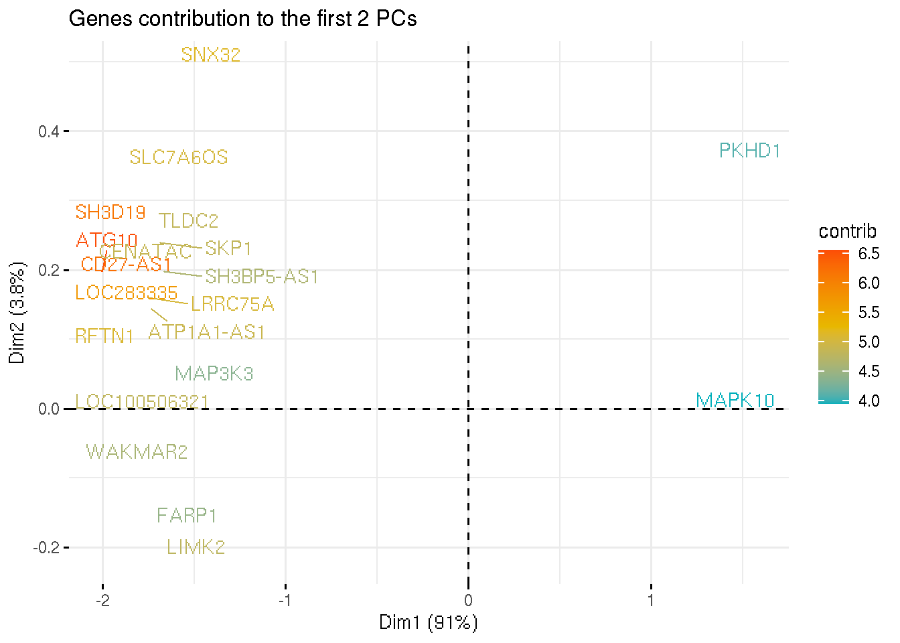

# DEG for dummies ... and biologists

As a rule of thumb, DE test is usually performed on the uncorrected counts rather than on the batch-corrected ones.

It is not ideal to run DE analysis on batch corrected values because the correction introduces a dependency between expression values, which will cause the 
violation of the indipendence assumption of every statistical tests (e.g. every measurements are independent from each other).

After performing the DE test it should be possible to determine if the results are biologically relevant or if the technical variability is affecting
the results by masking the important biological events.

In the cases where the batch is strong, it is possible to account for it during DE testing (like it is usually done in Bulk RNA-Seq) by

1. Setting `test.use` to either **LR**, **negbinom**, **poisson**, or **MAST**, and specifying the covariate variables with `latent.vars= c("covariate1","covariate2",..)`.
2. Using **monocle3** and providing the design to **fit_models**: `fit_models(cds_object, model_formula_str = "~gender + batch")`.
3. Correcting the batch with external packages (e.g. scVI or Scanorama) and running DE testing on the corrected counts.
4. Psudobulk

## To regress or not to regress

`vars.to.regress` is used to specify the variable to regress out during scaling, so that their effect does not contribute too much to the PCA. 

<div class="alert alert-info">
  <strong>NOTE:</strong> Regressing out genes, is only used for PCA dimension reduction, and does not affect DE testing.
</div>

On the other hand, `latent.vars` in `FindMarkers()` is used to pass variable that needs to be included into the differential expression model selected.
<div class="alert alert-info">
  <strong>NOTE:</strong> Latent variable will affect DE testing.
</div>


# Assay selection


# A word on the uMAP

When reading a umap, it is important to understand that:

1. The size of the cluster does not mean much
2. The global position of the clusters is better preserved in the umap projection, but the distances between clusters are not meaningful

In addition, the DE genes are not the genes driving the clustering and the cell displacement in the umap.
It is possible that there might be a degree of overlap and similarity, but that's all.
\
To get an understanding of why the umap looks like this, we need to check the genes in each dimension.

In bulk RNA-Seq, this is done by looking at the genes that contribute to the different PCs.



Using a dummy dataset (`pbmc_small`), something similar is also possible in single-cell

```{r, echo =FALSE, message=FALSE, warning=FALSE}
suppressPackageStartupMessages(library(Seurat))
data("pbmc_small")
pbmc_small <- FindNeighbors(pbmc_small, dims = 1:10)
pbmc_small <- FindClusters(pbmc_small, resolution = c(0.5,0.8,1,1.2,1.3))
pbmc_small <- RunUMAP(pbmc_small, dims = 1:10)
DimPlot(pbmc_small, reduction = "umap")
```

```{r, echo =FALSE, message=FALSE, warning=FALSE}
pbmc_small <- ProjectDim(pbmc_small, reduction = "umap")
```

The negative genes in both projections are the genes driving the clustering of cluster 3 apart from the rest of the 
cells. Are these genes genes DE in cluster 3? 
Maybe yes, maybe no. That is not the point.

