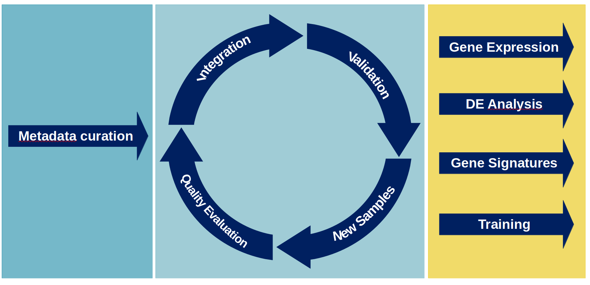

```{r, echo=FALSE}
library(kableExtra)
```

# 1. Atlas principles

An atlas does not only combine the data coming from multiple projects, but it attempts to harmonise its content to maximise the quantity and quality of
the information that can be extracted.

Minimise technical variability is a very important aspect and, for this process to be successful, great care has to be put into defining both wet and dry procedures.
Every steps of the process should be codified and documented; in particular:

1. Sample source
2. Wet and dry procedures
3. Sample information
4. Analyses steps


# 2. Process overview



## Metadata curation

Particular attention must be take in providing consistency between projects, diseases and processes.\
The information can changed during due course, but the changes must be documented and detailed.

We can use the definition of controls to make up an example. \

<div class="alert alert-info">
  <strong>Note:</strong> The following classification is not real and it is used only to make a point.  
</div>

At the beginning of the project it is decided to divide the control samples into three groups:

* **Real Control**: Healthy individual with no relationship with any of the patients. 

* **Healthy Control**: Healthy individual with a degree of kinship with a patient. 

* **Surgical Control**: Healthy individual in regards of the pathologies included in the study, but potentially affected by some other conditions. 

If later in the study it is decide to add one samples which is known to be a control but that cannot be classified in any of the three category, a new group should be created (e.g. **Undefined Control**) rather than forcing it into one of the existing category.
This is to avoid any confusion and ambiguity during the interpretation of the results of the downstream analyses.

This kind of critical thinking must be applied to all the available information, being the samples names, the diseases grouping or the way dates are recorded.

### Levels

It can be useful to include multiple levels of information, usually providing an increase in details from one level to the other.

1. **Level 1**: Immune component

2. **Level 2**: T cells

3. **Level 3**: T-CD8-central-memory

Different granularity allows for a better exploration of the data, as the queries can be tailored to the specific questions the use is trying 
to answer.

## Samples Processing

To minimise the technical variability, the parameters and conditions must be controlled, and things like genome built, software versions and parameters, must be kept
invariant and/or the most compatible as possible.
As the projects in the atlas span multiple years, it might be required the re-processing of some of the older samples. 

```{r, echo = FALSE}
alignment <- data.frame("Project" = c("Newer","Older"),"CellRanger" = c("7.1.0","latest supported by the chemistry"),
            "Genome" = "2020-A (July 7, 2020)",
           "parameters" = "include-introns")
kbl(alignment) %>%  kable_styling(fixed_thead = T) %>%   kable_paper("hover", full_width = F)
```

Cellranger 7.1 supports libraries going back to v2, and it should be fine to re-analyse the old projects.

<div class="alert alert-info">
  <strong>Note:</strong> The Bioinformatic platform should be involved.  
</div>

## Quality Control

Before the analysis of the sample can start, it is important to decide a set of rules to clearly quantify and define what makes a **good sample**, and how to deal with the **bad ones**.
For example, the samples that do not meet the minimum quality requirements can (and should) be removed or they can be kept and renamed with a dedicated label (e.g. **bad quality** samples).

```{r echo=FALSE}
quality_table <- data.frame(`Wet QC` = c("Ok","Ok","Failed"),
                            `Dry QC` = c("Ok","Failed","Failed"),
                            `Sample Quality` = c("Good","Low","Bad"))
names(quality_table) <- c("Wet QC","Dry QC","Sample quality")
kbl(quality_table) %>%  kable_styling(fixed_thead = T) %>%   kable_paper("hover", full_width = F)
```

## Samples integration

Considering the scope and size of the project, a reference-based mapping workflow will be used. 
To start, a good quality reference dataset of control samples will be built, and all the other samples will be aligned to it. 
New samples will be added to the older version of the atlas.

## Validation

Once the first integration is done (v1) the quality of the resulted dataset must be evaluated before any analysis can be started.
All the possible confounders should be tested, and useful metrics should be collect and stored for future comparison between versions.

## Deployment

The way the end user will interact with the atlas needs to be addressed as soon as possible, as it will affect how the analysis are performed.
There are currently multiple possibilities:

* Shiny app with dedicated hardware
* Web server built for purpuse (e.g. apache/django)
* R object passed down 
* Power point presentation ...

<div class="alert alert-info">
  <strong>Note:</strong> The Bioinformatic platform and the IT department should be involved.  
</div>


# 3. Proposed steps

1. Identification of the projects and samples to include
2. Re-processing of the non compatible projects (e.g. likely the old ones)
3. Metadata curation
4. Samples QC
5. Samples classification and inclusion selection
6. Integration
7. Atlas validation
8. Deployment


